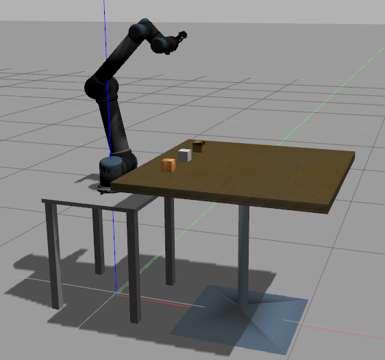

robot_arm_dev
===
Development of robotic grasping.  
For the simulation of the UR5 Robot with a Robotiq gripper. The simulation mimics the real experimental setup.

## Installation

Clone this and the gripper (robotiq) repositories
  ```
  $ git clone https://github.com/yongming-qin/robot_arm_dev
  ```
Build using catkin tools
  ```
  $ cd robot_arm_dev/grasping_ws
  $ catkin build
  $ source devel/setup.bash
  ```

## Visualization of UR5 in RViz

To visualize the model of the robot with a gripper, launch the following:
  ```
  $ roslaunch ur5_description display_with_gripper.launch
  ```
You can then use the sliders to change the joint values and the gripper values.

## Simulation in Gazebo

To simulate the robot launch the following:
  ```
  $ roslaunch ur5_gazebo ur5_cubes.launch
  ```
You should see something similar to the following picture:


By default the simulation starts paused. Unpause the simulation. You can then send commands to the
joints or to the gripper.

The following is an example of an action client to change the gripper configuration. Open a new
terminal, and then execute:
  ```
  $ rosrun ur5_gazebo send_gripper.py --value 0.5
  ```
where the value is a float between 0.0 (closed) and 0.8 (open).

An example of sending joints values to the robot can be executed as follows:
  ```
  $ rosrun ur5_gazebo send_joints.py
  ```
To change the values of the joints, the file `send_joints.py` must be modified.

## SLAM to estimate the pose of the end effector
Install Rtabmap SLAM package based on https://github.com/introlab/rtabmap_ros


Option 1. with Gazebo simulation  
```
$ roslaunch ur5_gazebo ur5_cubes.launch
$ roslaunch rtabmap_ros rtabmap.launch \
    rtabmap_args:="--delete_db_on_start" \
    depth_topic:=/camera/depth/image_raw \
    rgb_topic:=/camera/rgb/image_raw \
    camera_info_topic:=/camera/rgb/camera_info \
    approx_sync:=false
```

Option 2. with rosbag of real data
For example, with the rosbag for Auckland team
```
roslaunch rtabmap_ros rtabmap.launch \
    rtabmap_args:="--delete_db_on_start" \
    depth_topic:=/camera/aligned_depth_to_color/image_raw \
    rgb_topic:=/camera/color/image_raw \
    camera_info_topic:=/camera/color/camera_info \
    approx_sync:=false \
    frame_id:=camera_color_optical_frame\
```